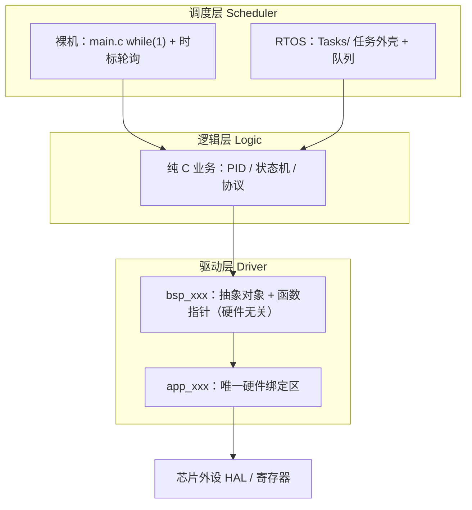
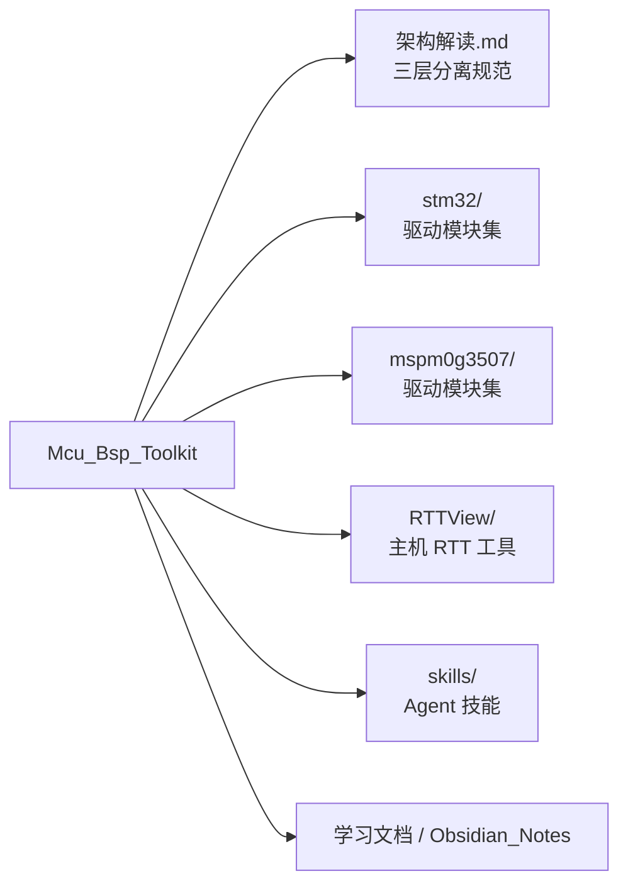

# Mcu_Bsp_Toolkit

嵌入式 **三层分离** 实践库：可复用驱动（STM32 / MSPM0）、架构说明、RTT 工具与学习资料。

核心理念：**驱动层与逻辑层保持不动，只替换最顶层调度（裸机 while / FreeRTOS Tasks）。**

## 系统架构图



## 仓库组成框图



## 目录说明

| 路径 | 内容 |
|------|------|
| `架构解读.md` | 三层架构、4 文件驱动 / 2 文件逻辑、命名规范 |
| `stm32/` | STM32 侧模块：串口、按键、IMU、Flash、电机、舵机、RTT EasyLog 等 |
| `mspm0g3507/` | MSPM0G3507 侧对应驱动模块 |
| `RTTView/` | 本机 RTT 查看相关工具（含 Web/探针扩展） |
| `skills/` | 嵌入式 / 文档 / Ralph 等 Agent Skills |
| `我的嵌入式学习文档/`、`Obsidian_Notes/` | 学习与笔记材料 |

## 驱动模块（两端对齐）

两侧目录均包含例如：`LED`、`串口`、`按键`、`SPI总线`、`总线sw_i2c`、`W25QXX`、`mpu6050`、`步进电机`、`舵机`、`霍尔电机`、`ALG` 等。

## 使用约定

- 换芯片：优先只改 `app_xxx` 绑定层，`bsp_xxx` 与 `Logic/` 尽量不动。
- 裸机 ↔ RTOS：复用 Drivers/Logic，仅增删 `Tasks/` 或改 `main.c` 调度。
- 排错分层：算错查 Logic；无信号查 Drivers；卡死查 Scheduler。

## 远程

```text
origin → https://github.com/linxi27667/Mcu_Bsp_Toolkit.git
```

本地常见路径：`E:\MCU\BSP`
